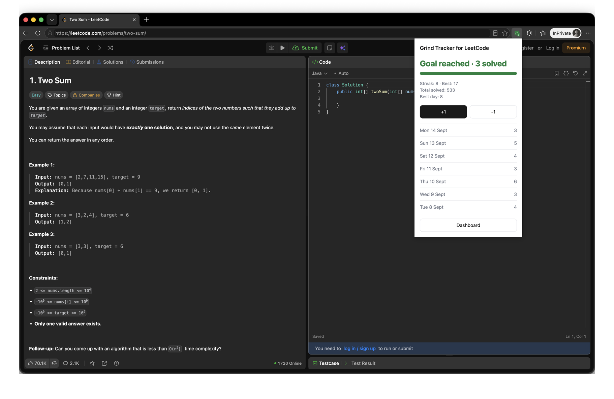
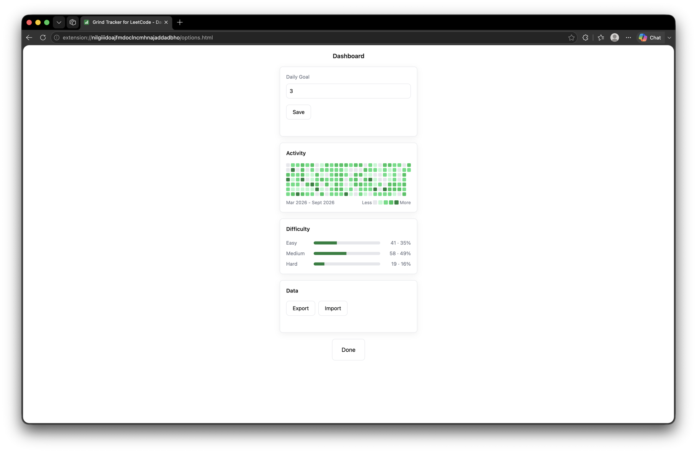

# Grind Tracker for LeetCode

[](https://github.com/konstantinosioan/grind-tracker-for-leetcode/actions/workflows/ci.yml)
[](LICENSE)

A Chrome and Edge extension that counts the LeetCode problems you solve, tracks the day's total against a goal you set, and keeps a streak going. Your progress shows in the popup and on the toolbar badge. It logs automatically when you get an Accepted submission, with a manual button as a fallback.

Built to keep myself consistent with a daily LeetCode goal.

_Not affiliated with or endorsed by LeetCode._

## Demo

_The screenshots below use example data._



The popup: today's progress, your streak, and a short recent history.



The dashboard (options page): a 26-week heatmap, the difficulty breakdown, and export/import.

## Features

- **Auto-logging**: detects an Accepted submission on LeetCode and logs it for you. A manual **+1 / -1** in the popup is the fallback.
- **Daily goal**: set your own (default 3); the popup shows the day's progress against it.
- **Streak**: consecutive days you hit the goal, alongside your best streak so far.
- **Badge**: the day's count on the toolbar icon, turning green once you hit the goal.
- **Dashboard**: a 26-week activity heatmap, an easy/medium/hard breakdown, and export/import, all on the options page.
- **Local only**: everything lives in `chrome.storage.local`. No account, no server, nothing leaves your machine.

## Install

The same package runs on Chrome, Edge and other Chromium browsers.

1. Clone the repo:
   ```
   git clone <repository-url>
   cd grind-tracker-for-leetcode
   ```
2. Open `chrome://extensions` (or `edge://extensions`).
3. Turn on **Developer mode**.
4. Click **Load unpacked** and select the cloned folder.
5. Pin the icon, then go solve something on LeetCode.

## How it works

**Auto-detection.** The content script only watches for a verdict right after you submit: it arms on a Submit-button click or Cmd/Ctrl+Enter, then counts the submission result once it appears if it reads "Accepted", and stops watching either way. That's what stops it from counting old solves when you scroll through your submission history, and it gives up after 20 seconds if nothing comes back. It reads the problem's difficulty off the page at the same time. It only ever reads the page you're on, never LeetCode's servers or API. If their markup ever changes, it quietly stops counting rather than breaking, with the manual button still there to cover you.

**Streak and days.** A "day" is your own local midnight, so counts line up with your calendar and not UTC. The current streak counts back from today over consecutive days that met the goal; a today that's still short of the goal doesn't break the run, it just holds at yesterday until the day is out. The best streak scans your whole history for the longest such run.

## Limitations and known behaviour

- It counts **accepted submissions, not unique problems**: re-solving something you've already done counts again (the same way the manual button counts clicks).
- **Difficulty is recorded for auto-detected solves only.** A manual +1 has no problem attached, so it adds to the day's total but not to the breakdown, and a -1 never touches the breakdown either, so the two can drift apart.
- Streaks and the heatmap always measure against your **current** goal, so changing the goal re-judges every past day.
- Auto-detection assumes the **English** LeetCode UI: it matches the word "Accepted".
- Counting from **two LeetCode tabs at the same instant** can, rarely, drop or double a solve.
- If LeetCode changes its page markup, auto-detection may quietly stop working. It fails safe: an undercount you can fix with the manual button, never a crash.
- **All data is local**: no sync across devices and no backup, so use the dashboard's export if you want a copy.

## Tech stack

- **Extension**: Manifest V3, vanilla HTML/CSS/JS. No framework, no build step, zero runtime dependencies.
- **Storage**: `chrome.storage.local`.
- **Icons**: designed in Figma.
- **Tooling** (dev only): ESLint, Prettier, `node --test`, GitHub Actions.

## Project structure

```
grind-tracker-for-leetcode/
├── manifest.json      # MV3 manifest: permissions, content script, service worker
├── background.js      # Service worker: badge, midnight rollover, message handling
├── content.js         # Injected on leetcode.com: detects an Accepted submission
├── popup.html         # Toolbar popup markup
├── popup.js           # Popup logic: progress, streak, recent history, +1/-1
├── options.html       # Dashboard markup
├── options.js         # Dashboard: heatmap, difficulty breakdown, export/import
├── storage.js         # Read/modify/write day counts and difficulty tallies
├── streak.js          # Pure date and streak logic (current and best streak)
├── validate.js        # Validates an imported data file
├── styles.css         # Shared styles for the popup and dashboard
├── streak.test.js     # Tests for the streak logic
├── validate.test.js   # Tests for the import validator
├── icons/             # Toolbar and store icons (16/32/48/128), made in Figma
├── API.md             # Generated JSDoc reference
├── PRIVACY.md         # Privacy policy
├── eslint.config.js   # ESLint flat config
├── package.json       # Dev tooling and scripts (no runtime dependencies)
└── .github/
    └── workflows/
        └── ci.yml     # Tests, format and lint checks on every push
```

## Development

```
npm install
npm test              # pure logic: streak + import validation (node --test, no framework)
npm run lint          # ESLint
npm run format:check  # Prettier
```

CI runs all three on every push.

## Documentation

Every top-level function is documented with JSDoc, and a generated reference lives in [`API.md`](API.md). It renders right here on GitHub, no clone needed.

## Privacy

The extension collects nothing and sends nothing off your device. Everything stays in `chrome.storage.local`. See [PRIVACY.md](PRIVACY.md) for the full policy.

## License

MIT, see [LICENSE](LICENSE).
